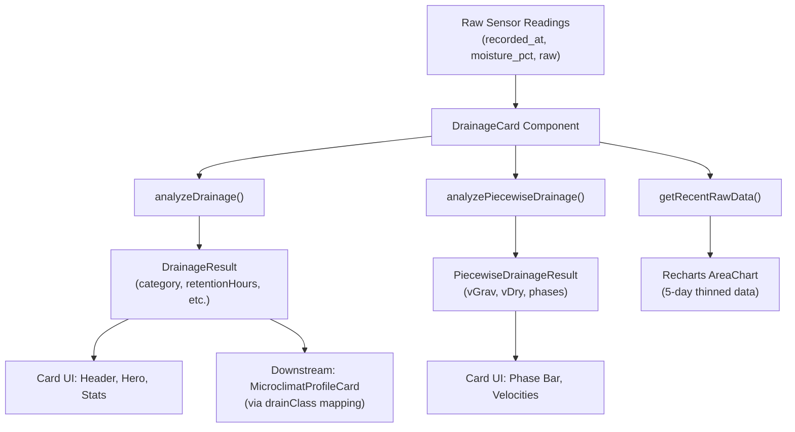
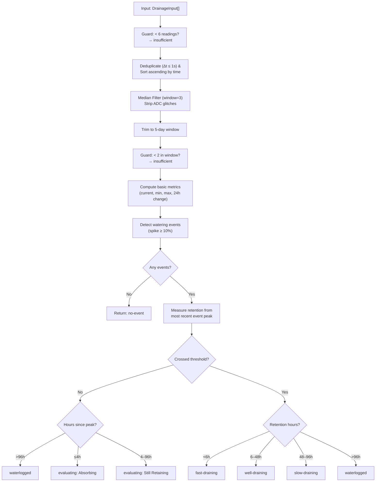

# Soil Water Dynamics — Observed Retention Analysis

> Complete technical documentation for [`DrainageCard.tsx`](file:///Users/Kamish/Desktop/JEBZ%20DEVVV/Main%20Projects/Plant%20monitoring%20system%20projecct%20lols/ViabilityNode/src/app/components/DrainageCard.tsx) and its companion library [`piecewiseDrainage.ts`](file:///Users/Kamish/Desktop/JEBZ%20DEVVV/Main%20Projects/Plant%20monitoring%20system%20projecct%20lols/ViabilityNode/src/lib/piecewiseDrainage.ts)

---

## 1. Purpose & Scope

The **DrainageCard** module is a client-side React component (`"use client"`) that analyzes time-series soil moisture data to characterize how a planting medium retains and releases water. It answers the question: _"After watering, how quickly does my soil drain?"_

It does this through two complementary analysis engines:

| Engine | Function | Location |
|--------|----------|----------|
| **`analyzeDrainage()`** | Retention-based classification — measures total hours from peak to a 10% drop | [`DrainageCard.tsx:135–398`](file:///Users/Kamish/Desktop/JEBZ%20DEVVV/Main%20Projects/Plant%20monitoring%20system%20projecct%20lols/ViabilityNode/src/app/components/DrainageCard.tsx#L135-L398) |
| **`analyzePiecewiseDrainage()`** | Three-phase biophysical model — splits the drainage curve into gravitational, field-capacity, and capillary/ET segments | [`piecewiseDrainage.ts:359–440`](file:///Users/Kamish/Desktop/JEBZ%20DEVVV/Main%20Projects/Plant%20monitoring%20system%20projecct%20lols/ViabilityNode/src/lib/piecewiseDrainage.ts#L359-L440) |

Both engines consume the same input data and are invoked in parallel inside the card's render function.

---

## 2. Data Flow Overview



---

## 3. Input Contract

### [`DrainageInput`](file:///Users/Kamish/Desktop/JEBZ%20DEVVV/Main%20Projects/Plant%20monitoring%20system%20projecct%20lols/ViabilityNode/src/app/components/DrainageCard.tsx#L32-L36)

```typescript
interface DrainageInput {
  recorded_at: string;    // ISO 8601 timestamp
  moisture_pct: number;   // Calibrated soil moisture 0–100%
  raw: number;            // Raw ADC value from the sensor
}
```

| Field | Description |
|-------|-------------|
| `recorded_at` | ISO timestamp of the reading. The module sorts internally, so order doesn't matter. |
| `moisture_pct` | Calibrated soil moisture percentage (0–100). This is the primary analysis signal, transformed via the calibration pipeline. |
| `raw` | Raw ADC integer from the hardware sensor. |

### Calibration Pipeline
Before ingestion, the raw ADC counts are transformed into `moisture_pct` using the hardware calibration constants (`Dry=1920` / `Wet=880`). Setting the dry ceiling at 1920 (above the typical 1916 open-air spike) is a critical guard against the UI rendering negative moisture percentages:

$$ \text{moisture\_pct} = \left( \frac{\text{ADC}_{\text{dry}} - \text{ADC}_{\text{raw}}}{\text{ADC}_{\text{dry}} - \text{ADC}_{\text{wet}}} \right) \times 100 $$

Documenting this calibration transformation ensures component inputs align with raw micro-controller payloads.

> [!IMPORTANT]
> The module requires **at least 6 readings** and **at least 2 readings within the last 5 days** to produce any result other than `"insufficient"`.

---

## 4. Constants

| Constant | Value | Purpose |
|----------|-------|---------|
| `FIVE_DAYS_MS` | `432,000,000` ms | Analysis observation window |
| `TWENTY_FOUR_H` | `86,400,000` ms | 24h net-change lookback |
| `SPIKE_THRESHOLD` | `10` (%) | Min % jump between consecutive readings to count as a watering event |
| `RETENTION_DROP` | `10` (%) | Absolute % drop from peak to measure retention time |
| `PHASE_1_BOUNDARY` | `70` (%) | Above this → gravitational drainage phase |
| `PHASE_2_UPPER` / `PHASE_2_LOWER` | `70` / `50` (%) | Field capacity transition zone |
| `PHASE_3_BOUNDARY` | `30` (%) | Below this → capillary/ET zone only |
| `PEAK_SEARCH_WINDOW_MS` | `14,400,000` ms (4h) | How far ahead to look for the actual peak after a spike |

---

## 5. Engine 1: `analyzeDrainage()` — Retention Classification

### 5.1 Processing Pipeline



### 5.2 Step-by-Step Calculations

#### Step 1 — Median Filter
```
For each reading at index i:
  window = readings[max(0, i-1) .. min(len, i+2)]   // 3 elements max
  sorted_values = sort(window.moisture_pct)
  filtered_value = sorted_values[floor(len/2)]       // median
```
**Why**: Isolated ADC glitches (single-sample noise spikes) are removed without distorting genuine trends. The window size of 3 preserves rapid legitimate changes like watering events.

#### Step 2 — Watering Event Detection
A **watering event** occurs when:
```
delta = moisture[i] − moisture[i−1]  ≥  SPIKE_THRESHOLD (10%)
```

After detecting a spike, the algorithm searches up to **4 hours ahead** for the maximum moisture value (the true peak), because moisture may continue rising after the initial jump due to absorption. Duplicate detection for the same event is prevented by comparing peak indices.

#### Step 3 — Retention Time Measurement
From the **most recent** watering event's peak:
```
retention_threshold = peak_moisture − RETENTION_DROP (10%)
```
The algorithm scans forward through post-peak readings:
- **First reading ≤ threshold** → `retentionHours = (dropTime − peakTime) / 3600000`
- **Never crosses threshold** → `retentionHours = null` (soil still holding)

#### Step 4 — Classification

| Category | Condition | Retention | drainClass |
|----------|-----------|-----------|------------|
| **`fast-draining`** | retention < 6h | Measured | `"rapid"` |
| **`well-draining`** | 6h ≤ retention ≤ 48h | Measured | `"moderate"` |
| **`slow-draining`** | 48h < retention ≤ 96h | Measured | `"stagnant"` |
| **`waterlogged`** | retention > 96h **or** elapsed > 96h without drop | Measured or null | `"stagnant"` |
| **`evaluating` (Absorbing)** | elapsed ≤ 4h, no threshold cross | null | `"unknown"` |
| **`evaluating` (Still Retaining)** | 4h < elapsed ≤ 96h, no threshold cross | null | `"unknown"` |
| **`no-event`** | No watering events detected in 5 days | null | `"unknown"` |
| **`insufficient`** | < 6 readings or < 2 in 5-day window | null | `"unknown"` |

### 5.3 Output: [`DrainageResult`](file:///Users/Kamish/Desktop/JEBZ%20DEVVV/Main%20Projects/Plant%20monitoring%20system%20projecct%20lols/ViabilityNode/src/app/components/DrainageCard.tsx#L48-L73)

| Field | Type | Description |
|-------|------|-------------|
| `category` | `DrainCategory` | One of 7 enum values (see table above) |
| `label` | `string` | Human-readable label for the category |
| `retentionHours` | `number \| null` | Hours from peak to 10% absolute drop. Null if not yet measured. |
| `currentMoisture` | `number \| null` | Latest calibrated reading in the window |
| `moistureMin` / `moistureMax` | `number` | Observed range over 5-day window |
| `netChange24h` | `number \| null` | `moisture[now] − moisture[24h ago]` — actual signed change |
| `wateringEvents` | `number` | Count of detected spikes in 5-day window |
| `lastWateringAt` | `string \| null` | ISO timestamp of the most recent peak |
| `peakMoisture` | `number \| null` | Peak % after the most recent watering |
| `peakDroppedTo` | `number \| null` | What moisture dropped to at the retention threshold |
| `drainClass` | `"rapid" \| "moderate" \| "stagnant" \| "unknown"` | Backward-compatible mapping for MicroclimatProfileCard |
| `description` | `string` | Dynamic natural-language summary |
| `plantHint` | `string` | Actionable plant-care recommendation |
| `color` / `textColor` / `bgColor` | `string` | Theme colors keyed to category |

---

## 6. Engine 2: `analyzePiecewiseDrainage()` — Three-Phase Biophysical Model

This engine comes from the ViabilityNode Technical Research Report (Sections 3–4). Instead of treating the entire drainage curve as one slope, it splits the post-watering curve into **three biophysically distinct phases**.

### 6.1 The Three Phases

```
100% ┌──────────────────────────────────────────┐
     │     ░░░░░░░░░░░░░░░░░░░░░░░░░░░░░░░░░░░│
     │     ░ PHASE 1: Gravitational Drainage  ░│
     │     ░ Macropore clearance (gravity)     ░│
 70% │─────░░░░░░░░░░░░░░░░░░░░░░░░░░░░░░░░░░░│ ← PHASE_1_BOUNDARY
     │     ▒▒▒▒▒▒▒▒▒▒▒▒▒▒▒▒▒▒▒▒▒▒▒▒▒▒▒▒▒▒▒▒▒│
     │     ▒ PHASE 2: Field Capacity          ▒│
     │     ▒ Matric potential dominates        ▒│
 50% │─────▒▒▒▒▒▒▒▒▒▒▒▒▒▒▒▒▒▒▒▒▒▒▒▒▒▒▒▒▒▒▒▒▒│ ← PHASE_2_LOWER
     │     ▓▓▓▓▓▓▓▓▓▓▓▓▓▓▓▓▓▓▓▓▓▓▓▓▓▓▓▓▓▓▓▓▓│
 30% │─────▓▓▓▓▓▓▓▓▓▓▓▓▓▓▓▓▓▓▓▓▓▓▓▓▓▓▓▓▓▓▓▓▓│ ← PHASE_3_BOUNDARY
     │     ▓ PHASE 3: Capillary / ET          ▓│
     │     ▓ VPD & root uptake only            ▓│
  0% └──────────────────────────────────────────┘
           Time →
```

| Phase | Moisture Range | Dominant Force | Metric |
|-------|---------------|----------------|--------|
| **Phase 1** | > 70% | Gravity (macropore drainage) | V<sub>grav</sub> |
| **Phase 2** | 30–70% (specifically 50–70% for timing) | Matric potential | Phase 2 duration |
| **Phase 3** | < 30% | Capillary tension + evapotranspiration | V<sub>dry</sub> |

### 6.2 Velocity Calculations

#### V<sub>grav</sub> — Gravitational Clearance Rate
```
V_grav = (Moisture_peak − 50%) / (t_50% − t_peak)   [%/hr]
```
Measures how fast gravity clears the macropores. **Only computed when peak > 70% and the soil eventually crosses below 50%.**

> [!NOTE]
> **Why 50% instead of 70%?**
> $V_{\text{grav}}$ evaluates clearance down to the 50% Field Capacity midpoint rather than terminating at the 70% Phase 1 boundary to capture the complete gravitational runoff tail. Phase 1 Duration tracks time strictly above 70%, but the actual gravitational force continues diminishing into the upper half of Phase 2.

Interpretation:
| V<sub>grav</sub> | drainClass | Meaning |
|-----------|------------|---------|
| > 3.0 %/hr | `"rapid"` | Very fast macro clearance |
| 0.8–3.0 %/hr | `"moderate"` | Reasonable clearance |
| < 0.8 %/hr | `"stagnant"` | Slow/blocked macropores |

#### V<sub>dry</sub> — Transpiration / Drying Rate
```
V_dry = (50% − 30%) / (t_30% − t_50%)   [%/hr]
```
Measures the slower capillary/ET-driven drying once gravitational drainage is exhausted. **Only computed when soil crosses both 50% and 30%.**

Cross-referencing atmospheric drying power (`vpd_kpa`) allows distinguishing between stagnant soil drainage vs. low ambient evaporation demand (optimal range 0.4–1.6 kPa). Additionally, the system incorporates the impact of Botanical Light Pollution (Artificial Light at Night/ALAN). Research by Ian Ashdown (2016) indicates that red (660nm) and far-red (730nm) light from modern LEDs can interfere with the phytochrome switch (P_r to P_{fr} isoforms), keeping stomata open or closed unnaturally. This interference can skew the calculated V_dry and signal false transpiration demand.

Interpretation:
| V<sub>dry</sub> | Visual Color | Meaning |
|----------|------------|---------|
| > 0.5 %/hr | Amber | Active ET / drying |
| 0.1–0.5 %/hr | Zinc-300 | Normal slow dry |
| < 0.1 %/hr | Zinc-500 | Very slow (high humidity or shade) |

### 6.3 Phase 1 Failure Detection

```typescript
phase1Failure =
  currentPhase === 1 &&           // Currently above 70%
  hoursAbove70 > 24 &&            // Been there for > 24 hours
  (vGrav === null || vGrav < 0.5) // No/poor gravitational clearance
```

This indicates **anoxia risk** — the soil's macropores are not draining, which can suffocate roots. Triggers a red "Macropore failure" alert in the UI.

### 6.4 Output: [`PiecewiseDrainageResult`](file:///Users/Kamish/Desktop/JEBZ%20DEVVV/Main%20Projects/Plant%20monitoring%20system%20projecct%20lols/ViabilityNode/src/lib/piecewiseDrainage.ts#L56-L91)

| Field | Type | Description |
|-------|------|-------------|
| `vGrav` | `number \| null` | Gravitational clearance velocity (%/hr) |
| `vDry` | `number \| null` | Transpiration/drying velocity (%/hr) |
| `phase1DurationHours` | `number \| null` | Hours to transit from peak to 50% |
| `phase2DurationHours` | `number \| null` | Hours in the 70–30% field capacity zone |
| `phase3DurationHours` | `number \| null` | Hours below 30% |
| `currentPhase` | `1 \| 2 \| 3 \| null` | Which phase the latest reading is in |
| `currentPhaseSince` | `string \| null` | ISO timestamp when current phase began |
| `phase1Failure` | `boolean` | True if macropore failure detected |
| `hoursAbove70` | `number \| null` | Continuous hours above 70% (null if not in Phase 1) |
| `vpd_kpa` | `number \| null` | Optional environmental input to correlate with capillary drying rate |
| `alan_interference` | `boolean` | True if Botanical Light Pollution (ALAN) is detected |
| `drainClass` | `"rapid" \| "moderate" \| "stagnant" \| "unknown"` | Backward-compatible classification |
| `retentionHours` | `number \| null` | Backward-compat: same as analyzeDrainage's retention |
| `wateringEvents` | `number` | Count of detected events |
| `lastWateringAt` | `string \| null` | ISO timestamp of most recent peak |
| `peakMoisture` | `number \| null` | Peak moisture after last watering |

---

## 7. Signal Processing

### 7.1 Pre-Processing & Median Filter

Telemetry logs can contain near-simultaneous packet bursts, which can fill the 3-sample median window, rendering noise filtering ineffective. Therefore, a mandatory deduplication step is required.

**Rule: Deduplicate (Δt ≤ 1s) and time-sort prior to filtering.**

After deduplication, both engines apply an identical **size-3 median filter**:

```
Input:   [..., 42, 95, 43, 44, ...]    ← 95 is an ADC glitch
Median:  [..., 42, 43, 43, 44, ...]    ← glitch removed
```

This is a non-linear filter that:
- Removes single-sample noise spikes without introducing lag
- Preserves genuine step-changes (watering events appear as multi-sample jumps)
- Is applied after deduplication and sorting by time, before windowing

### 7.2 Watering Event Detection Algorithm

```
for each consecutive pair (i-1, i):
  delta = moisture[i] - moisture[i-1]
  if delta ≥ 10%:
    search [i .. i+4h] for max moisture → peakIdx, peakMoisture
    if peakIdx not already recorded:
      emit WateringEvent(spikeIdx=i, peakIdx, peakMoisture, timestamp)
```

Key behaviors:
- The **4-hour forward search** accounts for gradual water absorption after application
- **Deduplication** ensures the same absorption curve doesn't produce multiple events
- Multiple distinct waterings within the 5-day window are counted and displayed

---

## 8. UI Components

### 8.1 Component Hierarchy

```
DrainageCard (main export)
├── Header (category badge, icon, title "Soil Water Dynamics")
├── Hero: Retention Time (big number or status text)
├── Stats Row
│   ├── 24h Change (netChange24h with trend icon)
│   └── Watering Events (count in 5-day window)
├── PhaseIndicatorBar (3-phase progress bar)
├── PiecewiseVelocities (V_grav + V_dry cards)
├── MoistureRangeBar (observed min/max range bar)
├── Last Watering Info (timestamp + peak→drop)
├── 5-Day Moisture Chart (Recharts AreaChart)
├── Description (dynamic text from result.description)
└── Plant Hint (actionable recommendation callout)
```

### 8.2 [`MoistureRangeBar`](file:///Users/Kamish/Desktop/JEBZ%20DEVVV/Main%20Projects/Plant%20monitoring%20system%20projecct%20lols/ViabilityNode/src/app/components/DrainageCard.tsx#L402-L451)

Visualizes the current moisture position within the 5-day observed min/max range:

```
position = ((current − min) / (max − min)) × 100   [clamped 0–100%]
```

Renders a gradient bar (red → green → blue) with a dot indicator at the current position.

### 8.3 [`PhaseIndicatorBar`](file:///Users/Kamish/Desktop/JEBZ%20DEVVV/Main%20Projects/Plant%20monitoring%20system%20projecct%20lols/ViabilityNode/src/app/components/DrainageCard.tsx#L485-L540)

Shows which of the three biophysical phases the soil is currently in:

```
position = 100 − currentMoisture   [clamped 0–100%]
```
> The inversion maps high moisture (left/Phase 1) to low moisture (right/Phase 3).

Renders three colored segments (30% / 40% / 30%) with boundary labels showing the phase constants.

**Phase Configuration:**

| Phase | Label | Color | Short Label |
|-------|-------|-------|-------------|
| 1 | Phase 1 — Gravitational Drainage | `#3b82f6` (blue) | Gravity |
| 2 | Phase 2 — Field Capacity | `#14b8a6` (teal) | Field Cap. |
| 3 | Phase 3 — Capillary / ET | `#f59e0b` (amber) | Capillary |

### 8.4 [`PiecewiseVelocities`](file:///Users/Kamish/Desktop/JEBZ%20DEVVV/Main%20Projects/Plant%20monitoring%20system%20projecct%20lols/ViabilityNode/src/app/components/DrainageCard.tsx#L544-L607)

Two-column grid displaying V<sub>grav</sub> and V<sub>dry</sub> with:
- Color-coded values (green → good, blue → okay, red → bad for V<sub>grav</sub>)
- Phase duration context ("Phase 1 cleared in X.Xh")
- Macropore failure alert (red border + warning icon)

### 8.5 Chart: 5-Day Moisture History

[`getRecentRawData()`](file:///Users/Kamish/Desktop/JEBZ%20DEVVV/Main%20Projects/Plant%20monitoring%20system%20projecct%20lols/ViabilityNode/src/app/components/DrainageCard.tsx#L77-L100) prepares chart data:

- Filters to last 5 days
- **Thins** to max 200 points if needed (keeps every Nth point for Recharts performance)
- Outputs `{ time: number, moisture: number, raw: number }[]`

Chart features:
- **Dashed reference line** at `peakMoisture − 10` (the retention threshold)
- **Custom tooltip** showing date, moisture %, and raw ADC value
- **Gradient fill** colored to match the current drainage category

### 8.6 Retention Display Formatting

```typescript
if (hours < 1)   → "{minutes}m"      // e.g. "45m"
if (hours < 24)  → "{hours}h"        // e.g. "12.3h"
if (hours ≥ 24)  → "{days}d {hrs}h"  // e.g. "2d 5h"
```

---

## 9. Color & Theming System

| Category | Primary Color | Text Class | Border | Background |
|----------|--------------|------------|--------|------------|
| `fast-draining` | `#10b981` (emerald) | `text-emerald-400` | `border-emerald-500/25` | `bg-emerald-950/20` |
| `well-draining` | `#3b82f6` (blue) | `text-blue-400` | `border-blue-500/25` | `bg-blue-950/20` |
| `slow-draining` | `#f59e0b` (amber) | `text-amber-400` | `border-amber-500/25` | `bg-amber-950/20` |
| `waterlogged` | `#ef4444` (red) | `text-red-400` | `border-red-500/25` | `bg-red-950/20` |
| `evaluating` (Absorbing) | `#3b82f6` (blue) | `text-blue-400` | `border-blue-500/25` | `bg-blue-950/20` |
| `evaluating` (Still Retaining) | `#8b5cf6` (violet) | `text-violet-400` | `border-violet-500/25` | `bg-violet-950/20` |
| `no-event` / `insufficient` | `#71717a` (zinc) | `text-zinc-400` | `border-zinc-800/80` | `bg-zinc-800/40` |

Colors propagate dynamically to: card border, header badge, chart stroke/fill, range bar indicator, phase dot, and plant hint callout.

---

## 10. Downstream Integration

### MicroclimatProfileCard

The `drainClass` field (backward-compatible mapping of `"rapid" | "moderate" | "stagnant" | "unknown"`) is consumed by [`MicroclimatProfileCard`](file:///Users/Kamish/Desktop/JEBZ%20DEVVV/Main%20Projects/Plant%20monitoring%20system%20projecct%20lols/ViabilityNode/src/app/components/MicroclimatProfileCard.tsx) to:

1. Cross-reference drainage type with DLI (daily light integral) class in a `PLANT_LOOKUP` matrix
2. Generate plant suitability suggestions
3. Display drainage class with styled badges

### ThreatAlertsPanel & Sitter Mode

The [`ThreatAlertsPanel`](file:///Users/Kamish/Desktop/JEBZ%20DEVVV/Main%20Projects/Plant%20monitoring%20system%20projecct%20lols/ViabilityNode/src/app/components/ThreatAlertsPanel.tsx) and the **Sitter Mode** interface explicitly map output fields from `piecewiseDrainage.ts` to active threat monitors:

- **Rot Warning (Hypoxic / Macropore Failure)**: Triggered when `phase1Failure === true` and `hoursAbove70 > 24` combined with low $V_{\text{grav}}$.
- **Dehydration Warning**: Triggered by Phase 3 saturation loss, driven by low moisture coupled with high $V_{\text{dry}}$ and extreme `vpd_kpa` values.

### drainClass Mapping Priority

The piecewise engine uses this fallback chain for backward-compat:

```
1. V_grav available?
   → > 3.0 %/hr     → "rapid"
   → 0.8–3.0 %/hr   → "moderate"
   → < 0.8 %/hr     → "stagnant"

2. retentionHours available?
   → < 6h           → "rapid"
   → 6–48h          → "moderate"
   → > 48h          → "stagnant"

3. Neither available  → "unknown"
```

---

## 11. Edge Cases & Guards

| Condition | Behavior |
|-----------|----------|
| < 6 total readings | Returns `"insufficient"` with guidance message |
| < 2 readings in 5-day window | Returns `"insufficient"` with guidance message |
| No watering events detected | Returns `"no-event"` — instructs user to water the plant |
| Watered < 4h ago, no threshold cross yet | Returns `"evaluating" / "Absorbing"` — defers classification |
| Watered 4–96h ago, still above threshold | Returns `"evaluating" / "Still Retaining"` — monitors for waterlogging |
| > 96h elapsed without threshold cross | Promotes from evaluating → `"waterlogged"` |
| Peak didn't reach Phase 1 (> 70%) | V<sub>grav</sub> may still compute using partial peak→50% rate, or returns null |
| Soil never dropped below 30% | V<sub>dry</sub> = null, Phase 3 duration = null |
| Narrow Sensor Dynamic Range | A hardcoded `SPIKE_THRESHOLD = 10%` may fail or false-trigger at 1–2 ADC counts per %. A dynamic spike threshold or raw ADC delta triggers tailored to sensor bit-resolution should be used. |
| Packet Burst Duplicates | Millisecond burst duplicates (Δt ≤ 1s) are deduplicated before median filtering. |
| ADC glitch (single-sample noise) | Removed by median filter before any calculation |
| > 200 data points in 5-day chart | Thinned by sampling every Nth point to keep Recharts under 200 points |

---

## 12. Worked Example

**Scenario**: A pothos plant is watered at 9:00 AM. Sensor reads every 15 minutes.

```
Time     Moisture%    What happens
09:00    35%          Pre-watering baseline
09:15    78%          Delta = +43% → watering event detected!
09:30    82%          ← peak (found within 4h search window)
09:45    80%
10:00    76%
12:00    68%          Dropped below PHASE_1_BOUNDARY (70%)
18:00    48%          Dropped below PHASE_2_LOWER (50%)
         ────         ← Retention threshold = 82% − 10% = 72%
10:15    71%          ← First reading ≤ 72% → retentionHours = 0.75h
```

**Results**:
- **Category**: `fast-draining` (retention 0.75h < 6h)
- **V<sub>grav</sub>**: (82% − 50%) / (18:00 − 09:30) = 32% / 8.5h = **3.76 %/hr** → `rapid`
- **V<sub>dry</sub>**: Not computed yet (hasn't reached 30%)
- **Phase 1 duration**: 2.5 hours (09:30 → 12:00)
- **Net 24h change**: Would be `moisture[now] − moisture[24h ago]`

---

## 13. Dependencies

| Dependency | Usage |
|------------|-------|
| `lucide-react` | Icons: Waves, Droplets, TrendingDown/Up, AlertTriangle, Clock, ArrowRight, Gauge, Wind |
| `recharts` | AreaChart, Area, XAxis, YAxis, Tooltip, ResponsiveContainer, ReferenceLine |
| `@/lib/piecewiseDrainage` | `analyzePiecewiseDrainage()`, `PiecewiseDrainageResult`, `PHASE_1_BOUNDARY`, `PHASE_3_BOUNDARY` |

---

## 14. Literature References

- **Cornell University CALS (NRCCA)**: Competency Area 2: Soil Hydrology. Basis for Field Capacity and Available Water Capacity thresholds.
- **FAO (Food and Agriculture Organization)**: Field Measurements and Infiltration functions based on the Kostiakov-Lewis relationships.
- **AHDB**: Standards for rootzone management, containerized crop drainage, and anoxia prevention.
- **Ian Ashdown (2016)**: *Botanical Light Pollution*. Details the impact of spectral power distribution on the phytochrome switch.
- **Correa-Cano et al. (2018)**: *Erosion of natural darkness in the geographic ranges of cacti*.

---

## 15. Exports Summary

| Export | Type | Description |
|--------|------|-------------|
| `DrainageInput` | interface | Input data shape |
| `DrainCategory` | type | 7-value union type for classification |
| `DrainageResult` | interface | Full output from `analyzeDrainage()` |
| `analyzeDrainage()` | function | Retention-based analysis engine |
| `DrainageCard` | React component | Main UI component |
